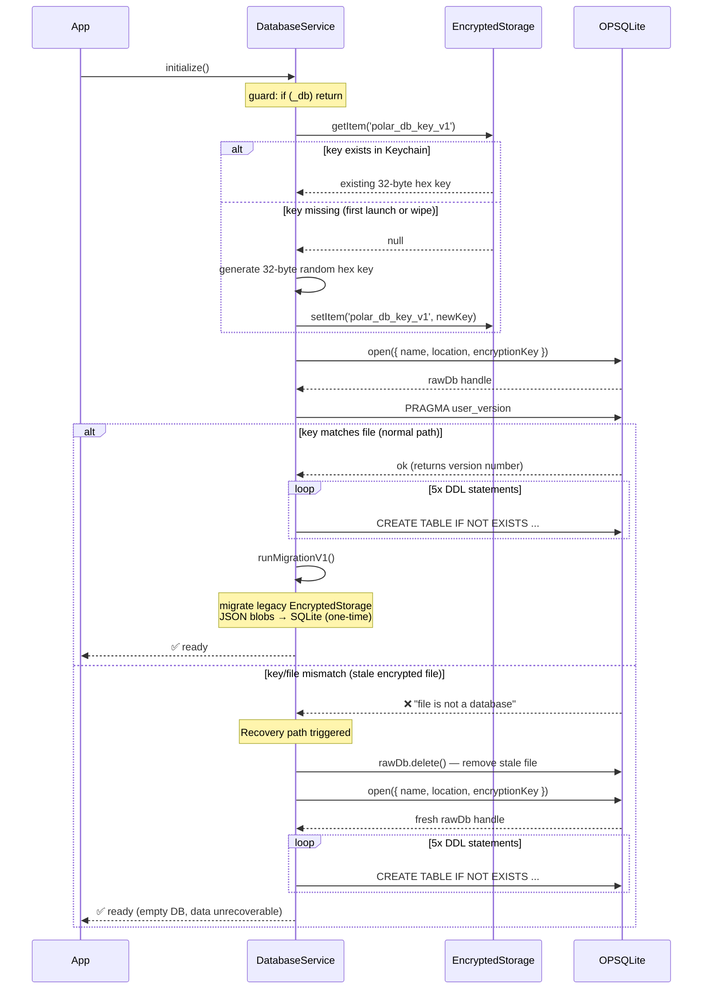

# DB Initialisation & Stale-Key Recovery

`DatabaseService.initialize()` is called once at app boot and again after a wipe.
SQLCipher silently accepts any key on `open()` — the mismatch is only detectable
on the first SQL operation (`PRAGMA user_version`).

## When does recovery trigger?

| Scenario                                      | Cause                                                          |
| --------------------------------------------- | -------------------------------------------------------------- |
| Device restore from backup                    | iOS restores the `.db` file but generates a new Keychain entry |
| `handleWipeEncryptedStorage` crash mid-flight | Key wiped but file survived                                    |
| Dev — "Simulate Stale DB" button              | Manual test: key deleted, file left on disk                    |
