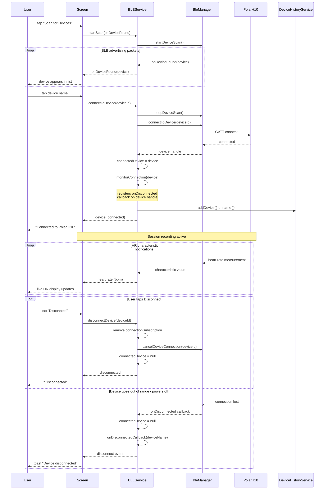

# BLE Connection Lifecycle

Full flow from the user tapping "Scan" through live HR streaming to disconnect.

```mermaid
sequenceDiagram
    participant User
    participant Screen
    participant BLEService
    participant BleManager
    participant PolarH10

    User->>Screen: tap "Scan for Devices"
    Screen->>BLEService: startScan(onDeviceFound)
    BLEService->>BleManager: startDeviceScan()

    loop BLE advertising packets
        BleManager-->>BLEService: onDeviceFound(device)
        BLEService-->>Screen: onDeviceFound(device)
        Screen-->>User: device appears in list
    end

    User->>Screen: tap device name
    Screen->>BLEService: connectToDevice(deviceId)
    BLEService->>BleManager: stopDeviceScan()
    BLEService->>BleManager: connectToDevice(deviceId)
    BleManager->>PolarH10: GATT connect
    PolarH10-->>BleManager: connected
    BleManager-->>BLEService: device handle
    BLEService->>BLEService: connectedDevice = device
    BLEService->>BLEService: monitorConnection(device)
    note over BLEService: registers onDisconnected<br/>callback on device handle
    BLEService->>DeviceHistoryService: addDevice({ id, name })
    BLEService-->>Screen: device (connected)
    Screen-->>User: "Connected to Polar H10"

    note over PolarH10,Screen: Session recording active

    loop HR characteristic notifications
        PolarH10-->>BleManager: heart rate measurement
        BleManager-->>BLEService: characteristic value
        BLEService-->>Screen: heart rate (bpm)
        Screen-->>User: live HR display updates
    end

    alt User taps Disconnect
        User->>Screen: tap "Disconnect"
        Screen->>BLEService: disconnectDevice(deviceId)
        BLEService->>BLEService: remove connectionSubscription
        BLEService->>BleManager: cancelDeviceConnection(deviceId)
        BLEService->>BLEService: connectedDevice = null
        BLEService-->>Screen: disconnected
        Screen-->>User: "Disconnected"
    else Device goes out of range / powers off
        PolarH10--xBleManager: connection lost
        BleManager-->>BLEService: onDisconnected callback
        BLEService->>BLEService: connectedDevice = null
        BLEService->>BLEService: onDisconnectedCallback(deviceName)
        BLEService-->>Screen: disconnect event
        Screen-->>User: toast "Device disconnected"
    end
```
