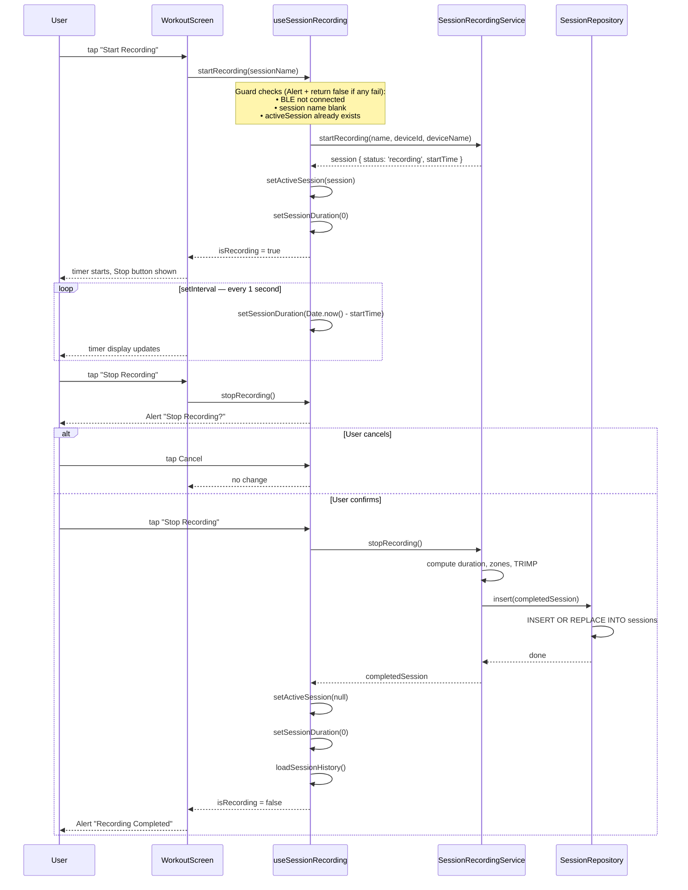

# Session Recording Flow

`useSessionRecording` orchestrates the UI state. `SessionRecordingService` manages
the active session lifecycle. `SessionRepository` persists the completed session
to SQLite.

