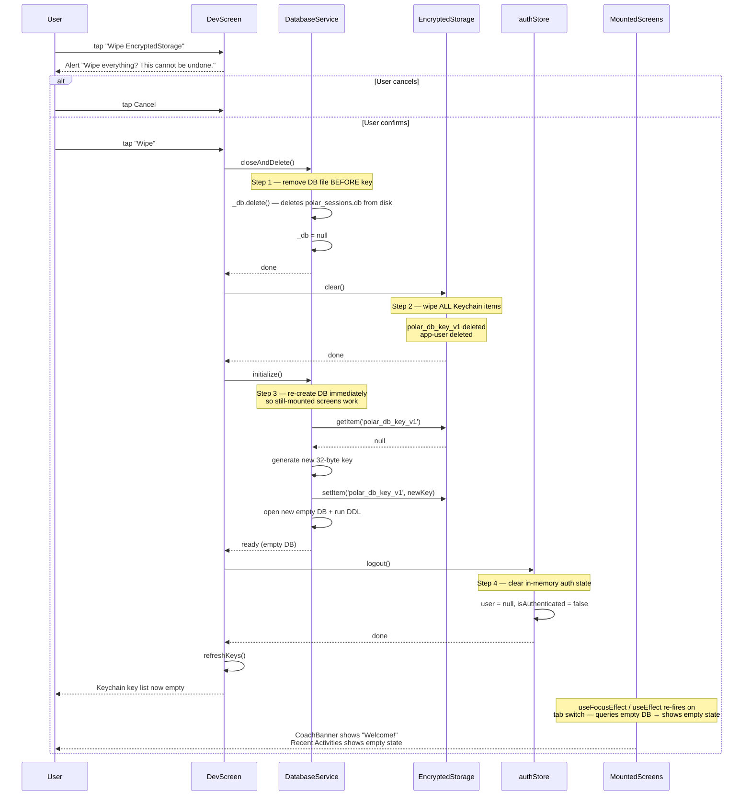

# Full Wipe Flow

`DevScreen → "Wipe EncryptedStorage"` performs a safe, ordered teardown:
DB file deleted **before** the key is wiped so key and file are never
simultaneously present in a mismatched state. A fresh DB is created
immediately so still-mounted screens don't hit "Database not initialized".



## Why this ordering matters

```
❌ Wrong order: clear() → closeAndDelete()
   Key gone first → file still encrypted with old key
   → next launch: new key generated → PRAGMA throws → recovery fires (data loss)

✅ Correct order: closeAndDelete() → clear() → initialize()
   File gone before key is gone
   → no stale file can exist → clean slate guaranteed
```
