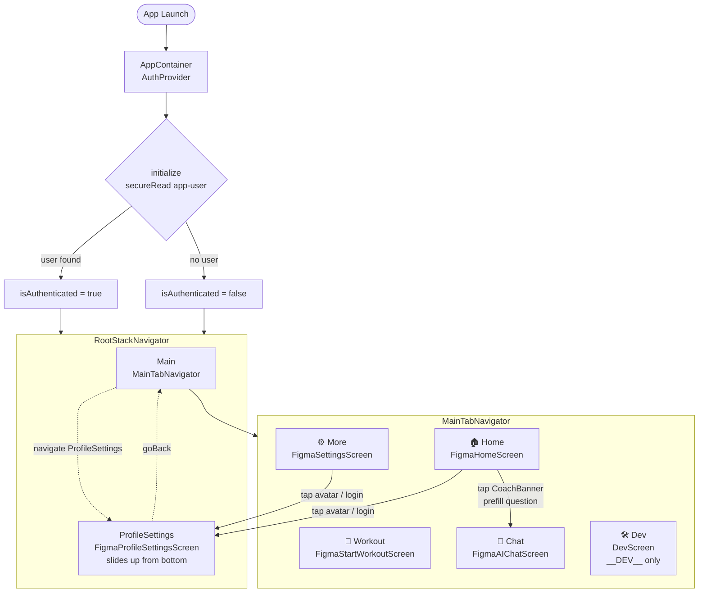

# App Navigation

## Screen responsibilities

| Screen | Primary purpose |
|---|---|
| `FigmaHomeScreen` | Dashboard — CoachBanner, rings, streak card, recent activities |
| `FigmaStartWorkoutScreen` | BLE scan, connect, start/stop session recording |
| `FigmaAIChatScreen` | Streaming AI chat with sports-science context injection |
| `FigmaSettingsScreen` | Physiology profile, theme, app preferences |
| `FigmaProfileSettingsScreen` | Sign up / log in modal (vertical slide) |
| `DevScreen` | Seed data, wipe storage, inspect AI context, simulate stale DB |
