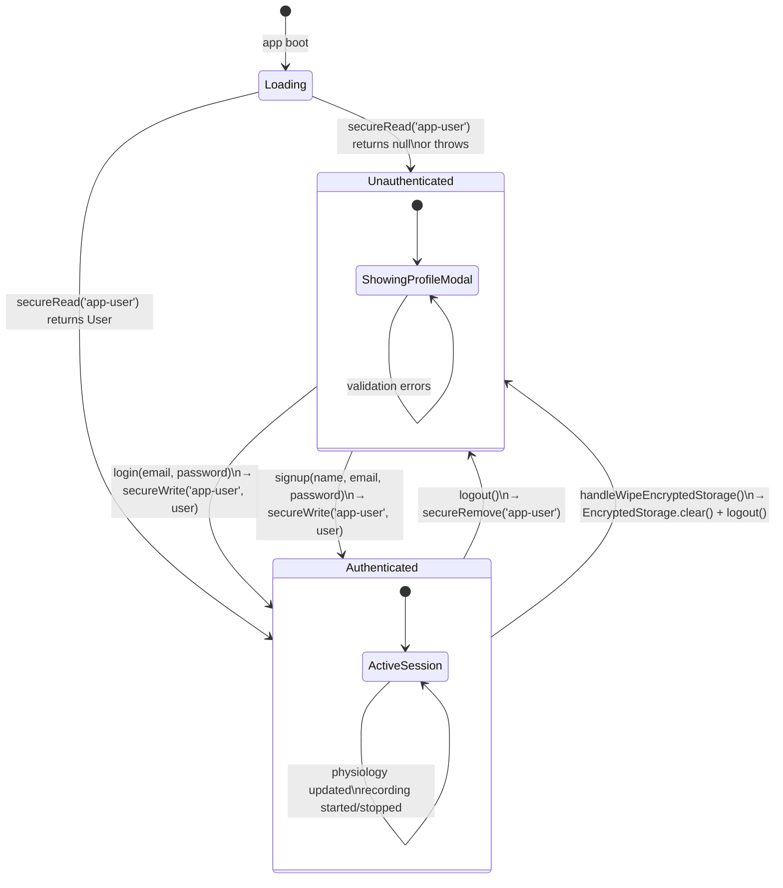

# Auth State Diagram

`authStore` (Zustand) manages the single auth lifecycle. There is currently no
navigation gate — the navigator renders the same tab layout regardless of
`isAuthenticated`. The profile modal is presented modally when the user taps
their avatar.



## User object shape

```typescript
{
  id:     string   // '1' (hardcoded — no backend yet)
  name:   string
  email:  string
  avatar: string   // first letter of name, uppercased
}
```
