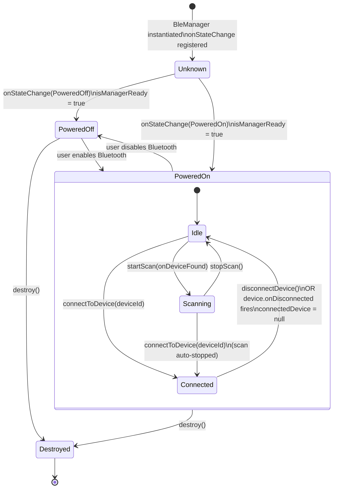

# BLE Connection State Diagram

`BLEService` wraps `react-native-ble-plx`. `isManagerReady` becomes `true`
on the first `onStateChange` callback (PoweredOn **or** PoweredOff) so the
UI can show a "Bluetooth off" message rather than a blank screen.

## Key fields per state

| State | `connectedDevice` | `isManagerReady` |
|---|---|---|
| Unknown | null | false |
| PoweredOff | null | true |
| Idle | null | true |
| Scanning | null | true |
| Connected | `Device` instance | true |
| Destroyed | null | false |
