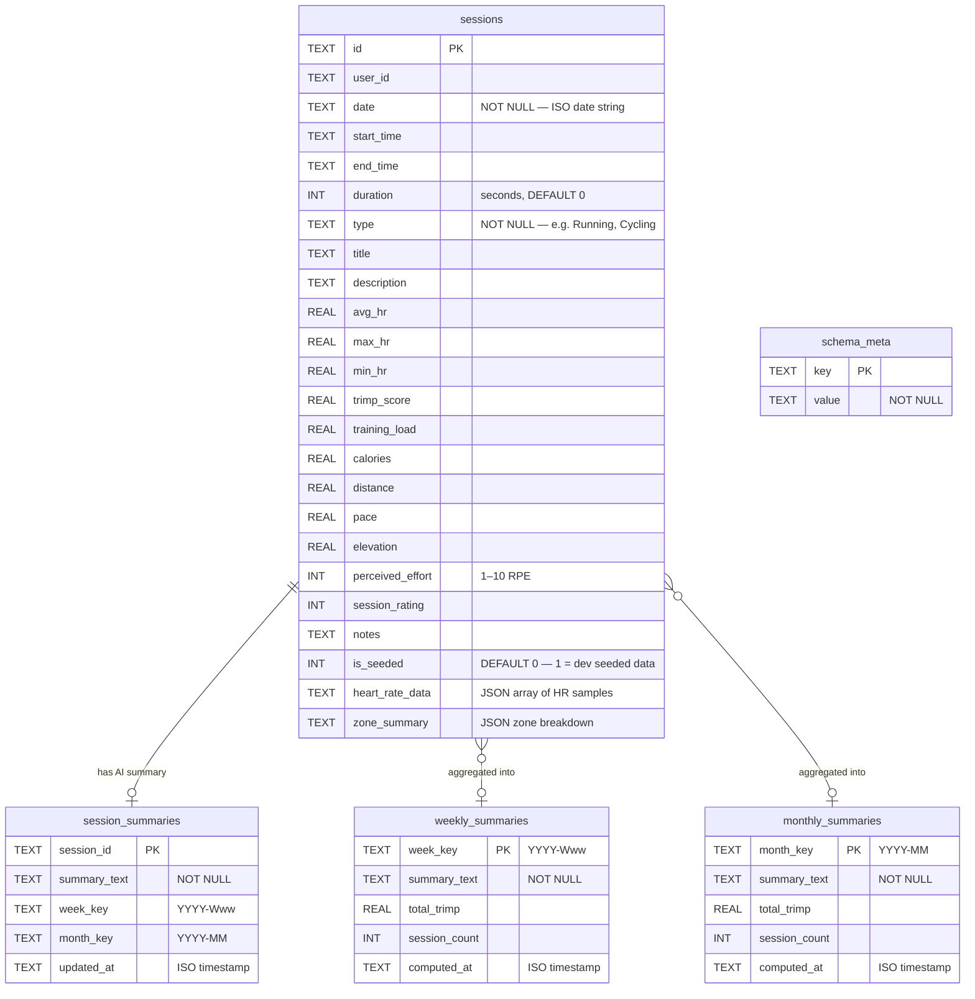

# Database Schema (ER Diagram)

`polar_sessions.db` — SQLCipher AES-256 encrypted SQLite database.

## Indexes

| Index | Table | Column(s) | Purpose |
|---|---|---|---|
| `idx_sessions_date` | sessions | `date DESC` | Fast date-range queries (ACWR, streak) |
| `idx_sessions_type` | sessions | `type` | Filter by workout type |

## Migration

`schema_meta` stores a `migration_v1_done` flag. On first run after the
SQLite migration, all sessions are read from the legacy `EncryptedStorage`
JSON blobs (`sessions_history`, `seeded_training_sessions`), inserted into
SQLite in a transaction, and the old keys are deleted. Subsequent launches
skip this entirely.
