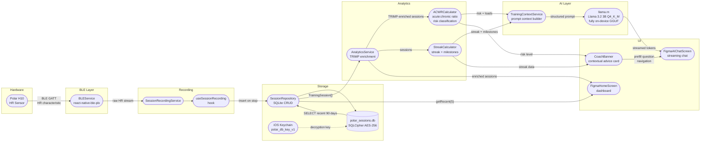

# End-to-End Data Flow

From the Polar H10 sensor through BLE, storage, analytics, and into the AI coach.

## Key design decisions

| Decision | Reason |
|---|---|
| All inference on-device (`llama.rn`) | No cloud dependency, no API key, works offline |
| SQLCipher page-level encryption | Health data encrypted even if device storage is accessed directly |
| `getRecent(90)` for ACWR | Covers the 28-day chronic window with buffer; avoids loading full history |
| TRIMP enriched before ACWR | ACWR needs a continuous load signal; TRIMP provides it from raw HR data |
| `TrainingContextService` as prompt layer | Decouples analytics logic from LLM prompting format |
