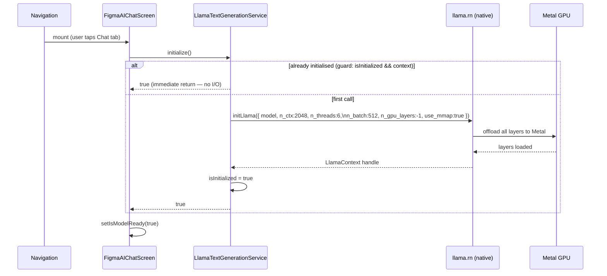
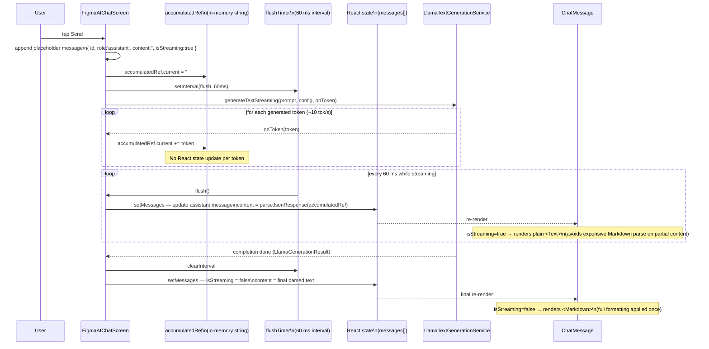
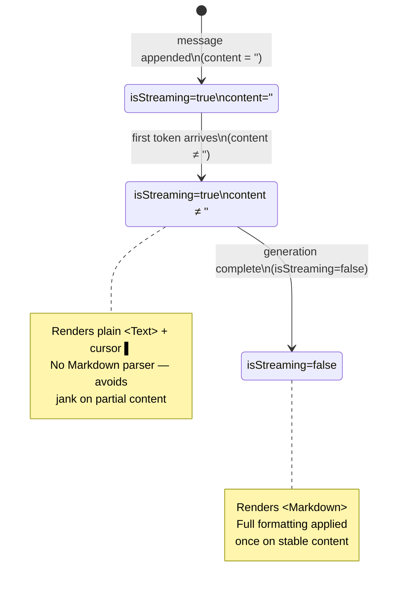

# LLM Chat — Streaming Pipeline

Covers model initialisation (with lazy-load guard), the token streaming loop,
the 60 ms batched-flush render strategy, and the three render states of
`ChatMessage`.

## Model initialisation

## Message send & streaming render

## ChatMessage render states

## Key design decisions

| Decision | Reason |
|---|---|
| `accumulatedRef` instead of state per token | Avoids ~300 React re-renders per reply; ref write is synchronous and free |
| 60 ms flush interval (~12 renders per reply) | Smooth enough for perception; coarse enough to batch many tokens per render |
| Plain `<Text>` while streaming | `react-native-markdown-display` parses the full string on every render — too expensive on incomplete/changing content |
| `<Markdown>` only once done | Content is stable; one parse pass produces correct formatting |
| `n_gpu_layers: -1` (Metal offload) | ~10.7 tok/s vs ~5.1 tok/s CPU-only on A-series — 2× throughput |
| Init guard (`isInitialized && context`) | 3B model loads once when Chat tab is first opened; re-navigation is free |
| `use_mmap: true` | Model pages loaded on demand from bundle; lower peak memory vs full `mlock` |
